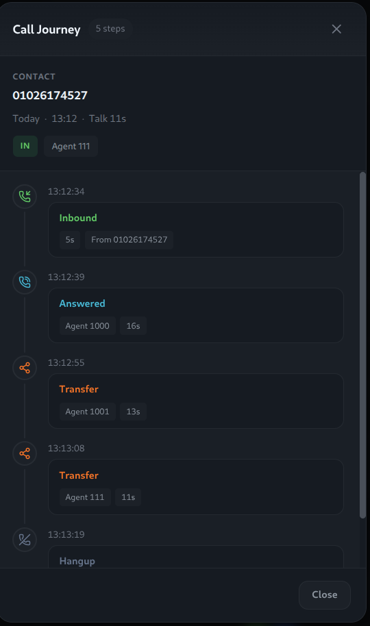
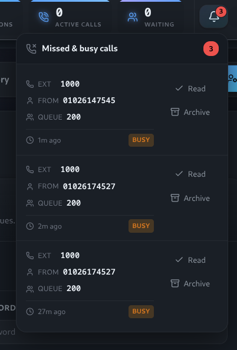
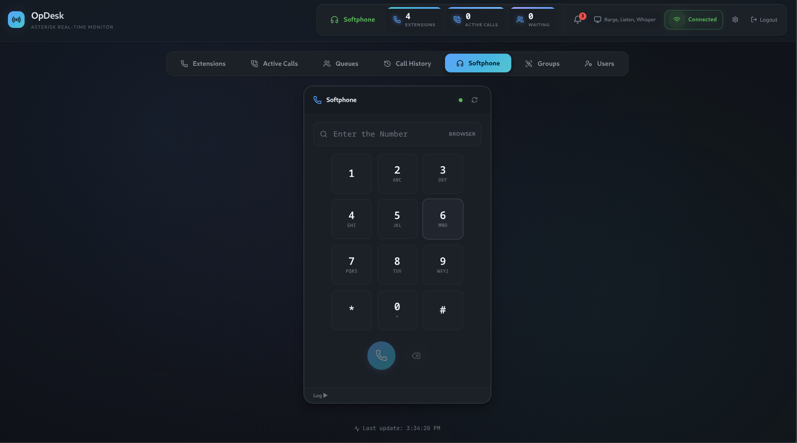
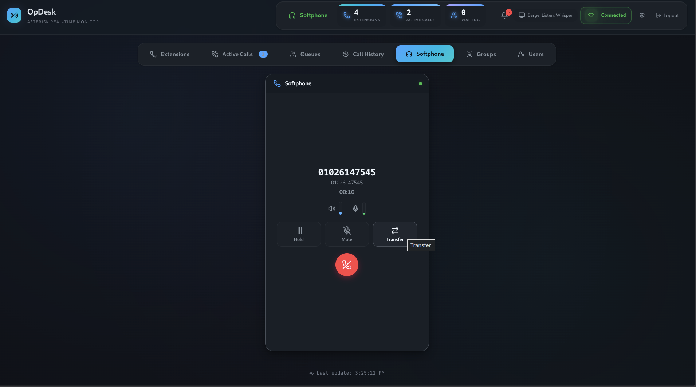
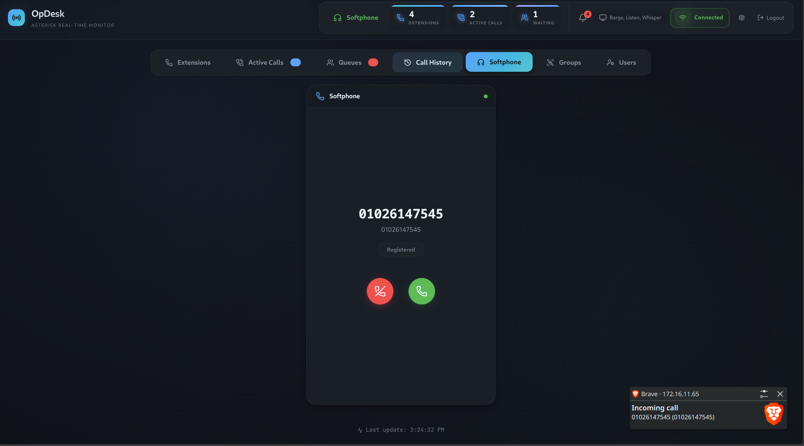

# OpDesk — Operator Panel for Asterisk

A real-time operator panel for **Asterisk PBX** (Issabel / FreePBX). Monitor extensions and queues, manage active calls, view CDR and recordings, and use a built-in WebRTC softphone—all in one web app.

| | |
|---|---|
| **Stack** | React + TypeScript (frontend), FastAPI + WebSockets (backend), MySQL/MariaDB |
| **Compatible with** | Issabel, FreePBX; Asterisk with AMI enabled |

---

## At a glance

- **Roles**: Admin (full access) and Supervisor (scoped to assigned extensions/queues).
- **Real-time**: Extension status, active calls, queue state, and call notifications via WebSocket.
- **Supervision**: Listen, Whisper, Barge (per-user configurable).
- **Call management**: CDR/call log, filtering, search, recording playback, QoS, **Call Journey** (timeline for multi-leg calls in the call log).
- **Web softphone**: Make/receive calls in the browser (WebRTC); hold, mute, transfer.
- **Notifications**: Missed/busy calls in a header bell; per-extension; mark read/archive; 7-day auto-cleanup of read items.
- **CRM**: Push call data to external CRMs (API Key, Basic Auth, Bearer, OAuth2).

---

## Prerequisites

- Linux (Debian/Ubuntu, CentOS/RHEL/Fedora, or Arch)
- Issabel or FreePBX with Asterisk and **AMI** enabled
- **WSS (WebSocket Secure)** enabled on FreePBX/Issabel for the WebRTC softphone
- MySQL/MariaDB (for FreePBX extension list)
- `sudo` and `curl` (for the installer)

The installer can install Python 3.11+, Node.js 24 (via nvm), git, lsof, and curl if missing.

---

## Installation

**One-liner:**

```bash
curl -k -O https://raw.githubusercontent.com/Ibrahimgamal99/OpDesk/main/install.sh && chmod +x install.sh && ./install.sh
```

**From repo:**

```bash
chmod +x install.sh && ./install.sh
```

The script clones to `/opt/OpDesk`, installs dependencies, detects Issabel/FreePBX, configures DB and AMI user `OpDesk`, creates `backend/.env`, and prints a summary.

**Default login after install:** Username **admin**, password as shown by the installer (e.g. `OpDesk@2026`). Change the password after your first login.

---

## Running

```bash
./start.sh
```

- Serves API + frontend at **https://&lt;server-ip&gt;:8443** (HTTPS). Change the port via **OPDESK_HTTPS_PORT** in `backend/.env`.
- Dev mode with hot reload: `./start.sh -d`.

---

## Quick reference

| Topic | Summary |
|-------|--------|
| **Auth** | Username or extension + password; JWT. Admin sees all; Supervisor sees only assigned extensions/queues. |
| **Softphone** | Enable **WSS** in FreePBX/Issabel. Requires HTTPS. `WEBRTC_PBX_SERVER` is set automatically (e.g. `wss://<server-ip>:8089/ws`); adjust in Settings if needed. |
| **Call Journey** | In Call Log: open the journey button (route icon) on a row to see the event timeline (queue, ring, answer, transfer, etc.). |
| **Call notifications** | Stored in `call_notifications`; MySQL event cleans read notifications after 7 days. |
| **CRM** | Settings → CRM Settings; configure URL and auth (API Key, Basic, Bearer, OAuth2). |

---

## Screenshots

| Active calls | Call Journey | Call log | Dashboard | Notifications | QoS |
|--------------|--------------|----------|-----------|---------------|-----|
| [](screenshots/active_calls.png) | [](screenshots/call_journey.png) | [](screenshots/call_history.png) | [](screenshots/extensions_dashboard.png) | [](screenshots/notfication.png) | [](screenshots/qos.png) |

| Queue | Softphone | Softphone (in-call) | Softphone (ringing) |
|-------|-----------|---------------------|---------------------|
| [](screenshots/queue.png) | [](screenshots/softphone.png) | [](screenshots/softphone_incall.png) | [](screenshots/softphone_rining.png) |

*QoS verified on FreePBX.*

---

## Architecture

```
┌─────────────────┐     ┌──────────────────┐     ┌─────────────────┐
│  React Frontend │◄───►│  FastAPI Server  │◄───►│  Asterisk AMI   │
│  (WebSocket)    │     │  (WebSocket)     │     │                 │
└─────────────────┘     └──────────────────┘     └─────────────────┘
```

---

## Tech stack

- **Backend**: Python 3.11+, FastAPI, WebSockets, asyncio, MySQL/MariaDB  
- **Frontend**: React 24, TypeScript, Vite, Framer Motion, Lucide React  

---

## Community & support

- **Mailing list**: [opdesk-dev@googlegroups.com](mailto:opdesk-dev@googlegroups.com)
- **Telegram**: [t.me/+i1OVDDPgGLo0MGZh](https://t.me/+i1OVDDPgGLo0MGZh)
- **Issues & contributions**: [GitHub Issues](https://github.com/Ibrahimgamal99/OpDesk/issues)
- **Author**: [Ibrahim Gamal](https://github.com/Ibrahimgamal99) — [LinkedIn](https://www.linkedin.com/in/ibrahim-gamal99) · ib.gamal.a@gmail.com

If OpDesk is useful to you: star the repo, report bugs, or contribute. The project is **MIT** licensed; developed by Ibrahim Gamal with AI-assisted tooling for boilerplate and acceleration.
