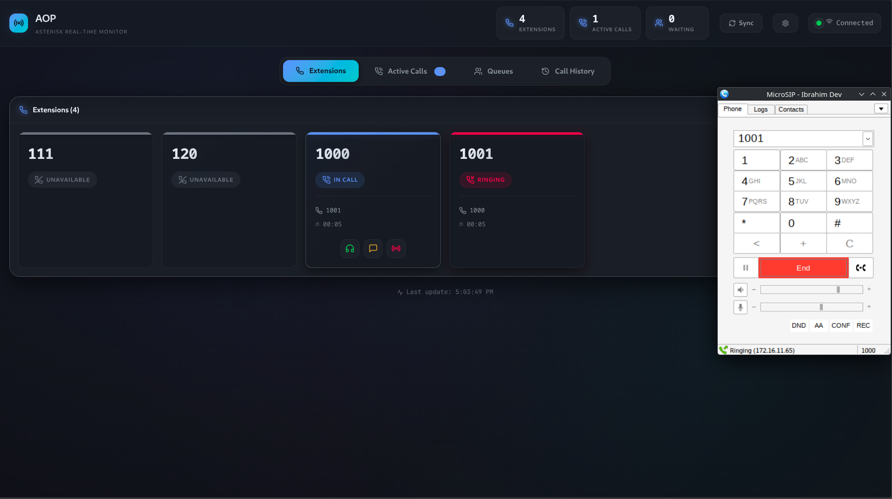
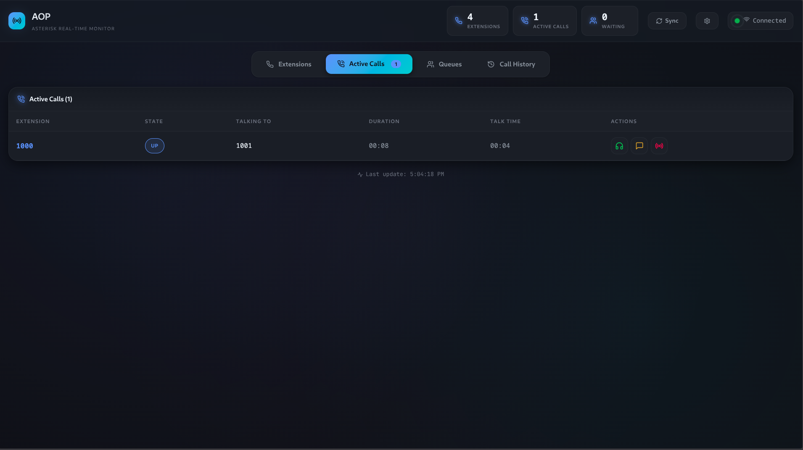
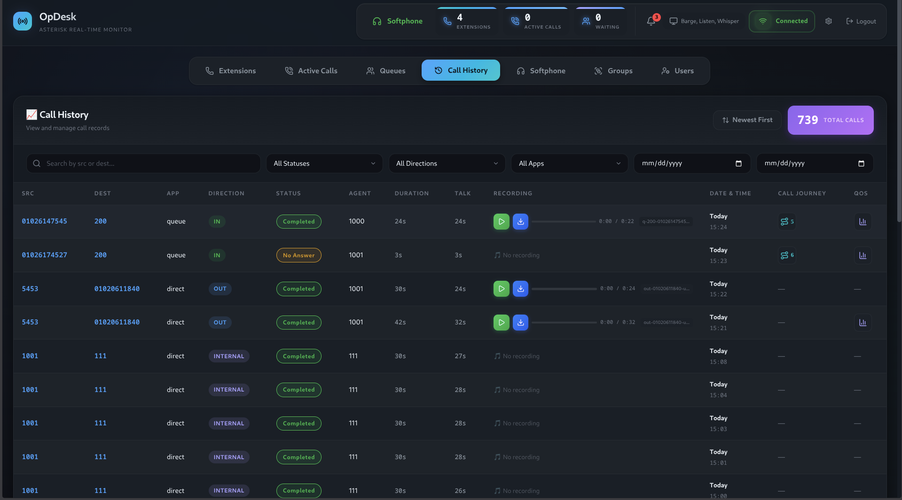
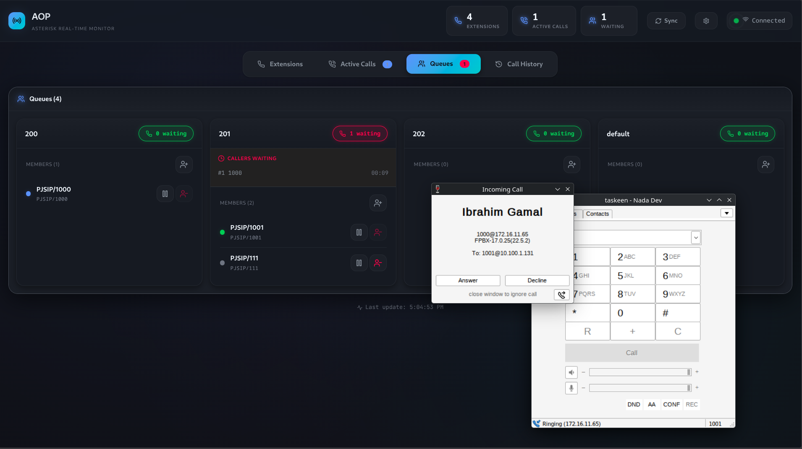
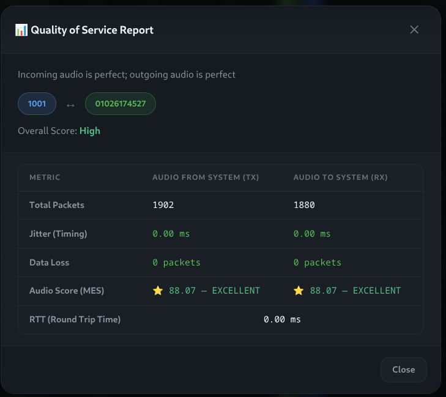
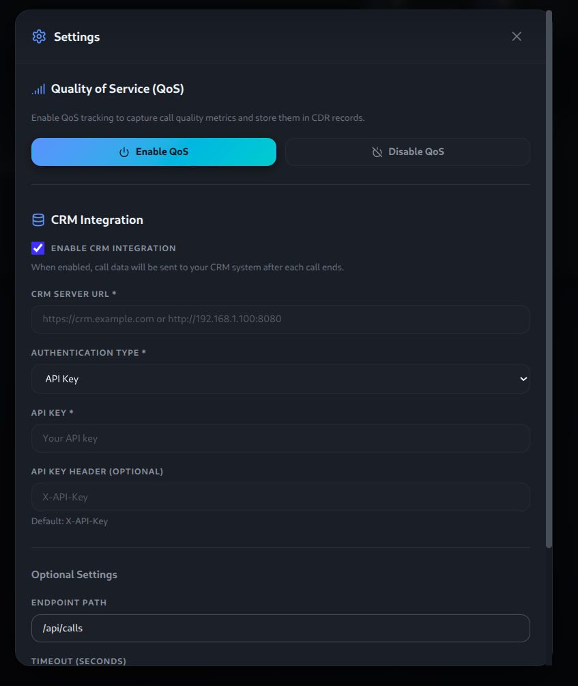

# Operator Panel Desk (OpDesk)

A modern, real-time operator panel for Asterisk PBX systems, similar to FOP2 but built with modern technologies.
 
## Features

- **Real-time Extension Monitoring**: Live status updates for all extensions
- **Active Call Tracking**: See who's talking to whom with duration and talk time tracking
- **Call Duration & Talk Time**: Track total call duration and actual conversation time separately
- **Call Log/CDR History**: View historical call records with filtering and search capabilities
- **Call Recording Playback**: Listen to recorded calls directly from the web interface
- **Queue Management**: Monitor and manage call queues
- **Supervisor Features**: Listen, whisper, and barge into calls
- **CRM Integration**: Send call data to external CRM systems with support for multiple authentication methods (API Key, Basic Auth, Bearer Token, OAuth2)
- **QoS Data**: View Quality of Service metrics for calls
- **WebSocket-based**: Event-driven architecture for instant updates

## Screenshots

### Main Dashboard

*Real-time extension monitoring and active call tracking*

### Active Calls Panel

*View active calls with duration and talk time tracking*

### Call Log/CDR History

*Historical call records with filtering and search capabilities*

### Queue Management

*Monitor and manage call queues in real-time*

### QoS Data

*View Quality of Service metrics for calls*

**Note:** QoS functionality has been tested and verified on FreePBX systems.

### Settings

*Configure CRM integration and application settings*

## Architecture

```
┌─────────────────┐     ┌──────────────────┐     ┌─────────────────┐
│  React Frontend │◄───►│  FastAPI Server  │◄───►│  Asterisk AMI   │
│  (WebSocket)    │     │  (WebSocket)     │     │                 │
└─────────────────┘     └──────────────────┘     └─────────────────┘
```

## Prerequisites

- Linux system (Debian/Ubuntu, CentOS/RHEL/Fedora, or Arch Linux)
- Issabel or FreePBX system installed
- Asterisk PBX with AMI enabled
- MySQL/MariaDB (for FreePBX extension list)
- sudo access (for installing system packages)
- **curl** (required for downloading nvm during installation)

**Note:** The installation script will automatically install:
- Python 3.11+ and pip
- Node.js 24+ (via nvm)
- git, lsof, and curl (if not already installed)

## Installation

### Automated Installation (Recommended)

Use the provided installation script for a complete automated setup:

**One-liner (download and run):**
```bash
curl -k -O https://raw.githubusercontent.com/Ibrahimgamal99/OpDesk/main/install.sh && chmod +x install.sh && ./install.sh
```

**Or if you already have the repository:**
```bash
chmod +x install.sh
./install.sh
```

The script will:
1. Detect your OS and install git, lsof, and curl (if not already installed)
2. Clone the repository to `/opt/OpDesk` (if not already present)
3. Install nvm (Node Version Manager) and Node.js 24
4. Install Python 3.11+ and pip
5. Auto-detect Issabel or FreePBX installation
6. Auto-configure database credentials:
   - **Issabel**: Retrieves MySQL root password from `/etc/issabel.conf`
   - **FreePBX**: Creates database user `OpDesk` with auto-generated password
7. Auto-configure AMI user `OpDesk` with random secret in `/etc/asterisk/manager.conf`
8. Create `backend/.env` file with all settings
9. Install Python dependencies (with `--break-system-packages` on Debian/Ubuntu)
10. Install Node.js dependencies
11. Display installation summary report

**Note:** The script automatically configures:
- Database connection (auto-detects credentials for Issabel/FreePBX)
- AMI user and secret (auto-generated and added to Asterisk config)
- CDR database name (`asteriskcdrdb`)
- Recording root directory (`/var/spool/asterisk/monitor/`)

### Manual Installation

If you prefer manual installation:

#### Backend

1. Install Python dependencies (system-wide, no virtual environment required):

```bash
cd backend
pip3 install --break-system-packages -r requirements.txt
```

**Note:** This project does not use a virtual environment. Dependencies are installed directly to your Python environment. The `--break-system-packages` flag is required for newer pip versions when installing system-wide.

2. Configure environment variables in `backend/.env`:

```env
# Operating System
OS=debian

# PBX System
PBX=FreePBX

# Database Configuration (for extensions list and CDR)
DB_HOST=localhost
DB_PORT=3306
DB_USER=asteriskuser
DB_PASSWORD=your_db_password
DB_NAME=asterisk
DB_CDR=asteriskcdrdb

# Asterisk Recording Root Directory
ASTERISK_RECORDING_ROOT_DIR=/var/spool/asterisk/monitor/

# AMI Configuration
AMI_HOST=127.0.0.1
AMI_PORT=5038
AMI_USERNAME=OpDesk
AMI_SECRET=your_ami_secret
```

**Note:** The installation script automatically creates this file with appropriate values for your system.

#### Frontend

1. Install Node.js 24 (if not already installed):

```bash
# Install nvm
curl -o- https://raw.githubusercontent.com/nvm-sh/nvm/v0.40.3/install.sh | bash
source ~/.nvm/nvm.sh
nvm install 24
nvm use 24
```

2. Install Node.js dependencies:

```bash
cd frontend
npm install
```

## Running

### Quick Start (Recommended)

After running the installation script (`./install.sh`), start the application:

```bash
./start.sh
```

This will start both backend and frontend services with logging. Press `Ctrl+C` to stop.

### Development Mode

#### Option 1: Using the start script (recommended)

```bash
./start.sh
```

#### Option 2: Manual start

Start the backend server:

```bash
cd backend
python server.py
```

The server will run on `http://localhost:8765`

Start the frontend development server (in a separate terminal):

```bash
cd frontend
npm run dev
```

The frontend will run on `http://localhost:5173` with hot reload.

### Production Mode

1. Build the frontend:

```bash
cd frontend
npm run build
```

2. Start the server (serves both API and frontend):

```bash
cd backend
python server.py
```

Access the application at `http://localhost:8765`

## API Endpoints

### REST API

- `GET /api/extensions` - Get list of monitored extensions
- `GET /api/calls` - Get active calls
- `GET /api/queues` - Get queue information
- `GET /api/status` - Get server status
- `GET /api/call-log` - Get call log/CDR history (supports `limit`, `date`, `date_from`, `date_to` parameters)
- `GET /api/recordings/{file_path}` - Serve call recording audio files
- `GET /api/settings` - Get application settings
- `POST /api/settings` - Update application settings
- `POST /api/supervisor/{action}` - Supervisor actions (listen, whisper, barge)

### WebSocket

Connect to `ws://localhost:8765/ws` for real-time updates.

The WebSocket connection provides:
- Real-time extension status updates
- Active call events
- Queue status changes
- Call log updates
- System notifications


## CRM Integration

OpDesk supports integration with external CRM systems to automatically send call data after each call ends.

### Supported Authentication Methods

- **API Key**: Custom header authentication
- **Basic Auth**: Username/password authentication
- **Bearer Token**: Token-based authentication
- **OAuth2**: OAuth2 flow with client credentials

### Configuration

CRM integration can be configured through the web interface (Settings → CRM Settings) or via the database settings table:

- `CRM_ENABLED`: Set to `true` or `1` to enable
- `CRM_SERVER_URL`: Your CRM server URL
- `CRM_AUTH_TYPE`: `api_key`, `basic_auth`, `bearer_token`, or `oauth2`
- Additional fields based on selected authentication type


## Technology Stack

### Backend
- **Python 3.11+**
- **FastAPI** - Modern async web framework
- **WebSockets** - Real-time communication
- **asyncio** - Async I/O for AMI communication
- **MySQL/MariaDB** - Database for extensions and CDR

### Frontend
- **React 24** - UI framework
- **TypeScript** - Type safety
- **Vite** - Build tool
- **Framer Motion** - Animations
- **Lucide React** - Icons

## Contact

For questions, issues, or contributions, please contact:

- **Email**: ib.gamal.a@gmail.com
- **LinkedIn**: [Ibrahim Gamal](https://www.linkedin.com/in/ibrahim-gamal99)
- **GitHub**: [Ibrahimgamal99](https://github.com/Ibrahimgamal99)

## Development Note

This project was entirely developed by Ibrahim Gamal, with AI tools assisting in generating repetitive code (boilerplate) and speeding up development.

## License

This project is open source and available under the MIT License.

## Support

OpDesk is free and open source. If you find it useful, please consider:

- ⭐ **Starring this repository** – it helps with visibility
- 🐛 **Reporting bugs or suggesting features** via [Issues](https://github.com/Ibrahimgamal99/OpDesk/issues)
- 💬 **Contributing** to the project

