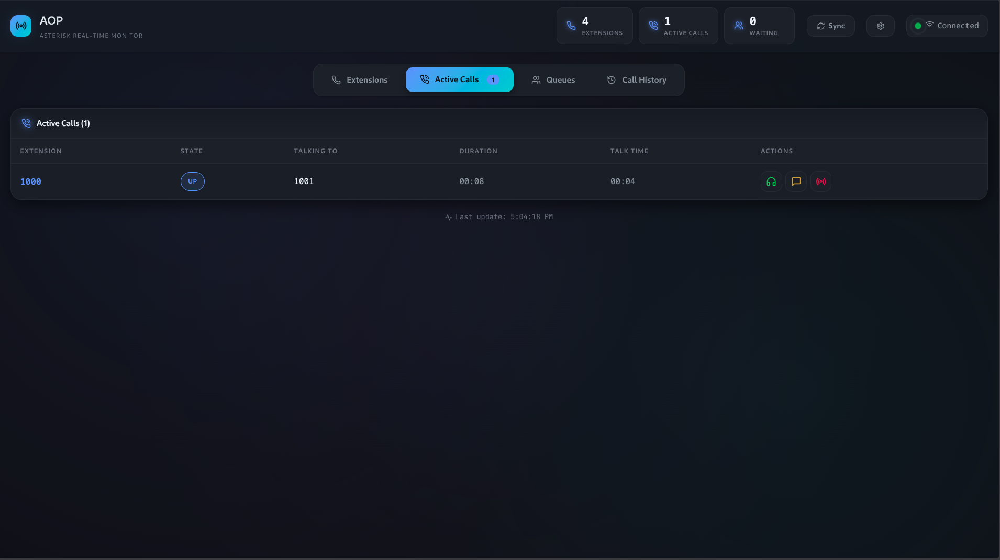
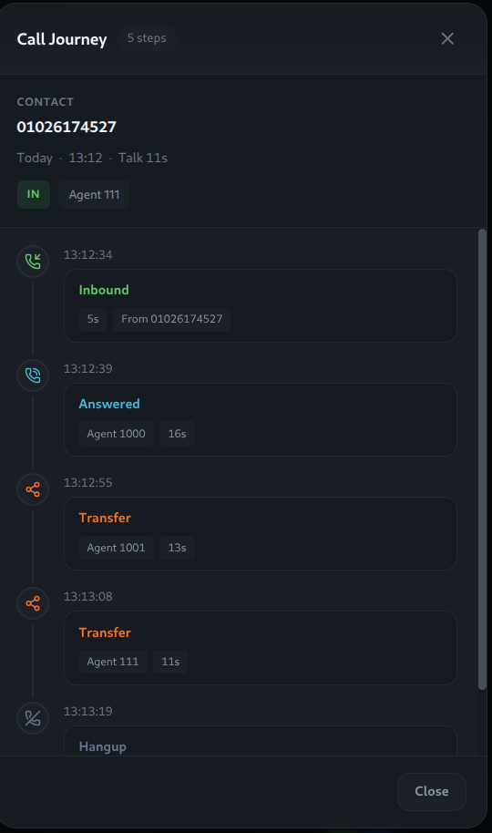
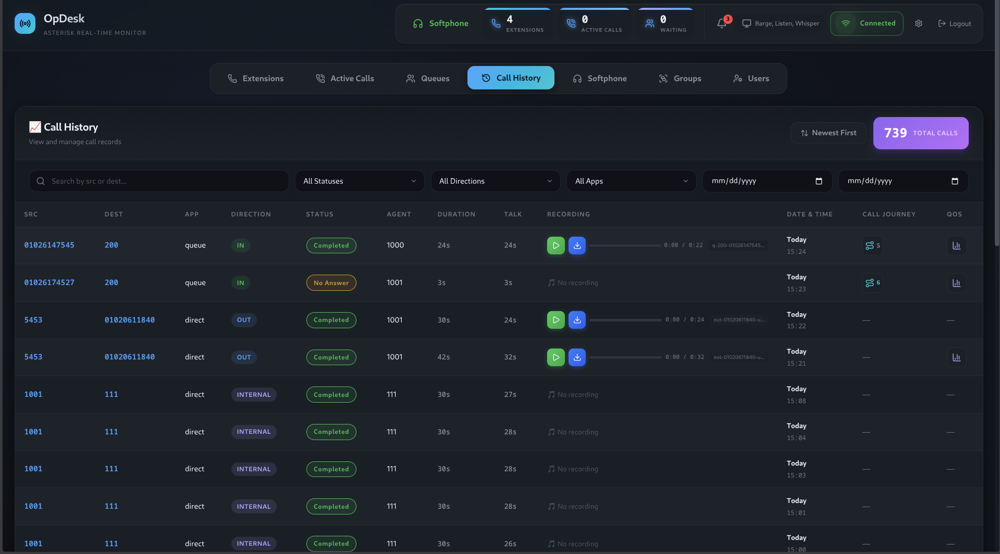
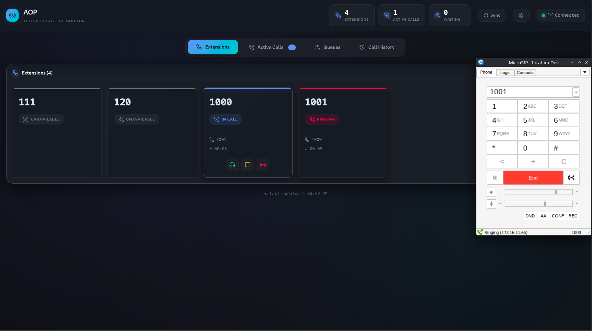
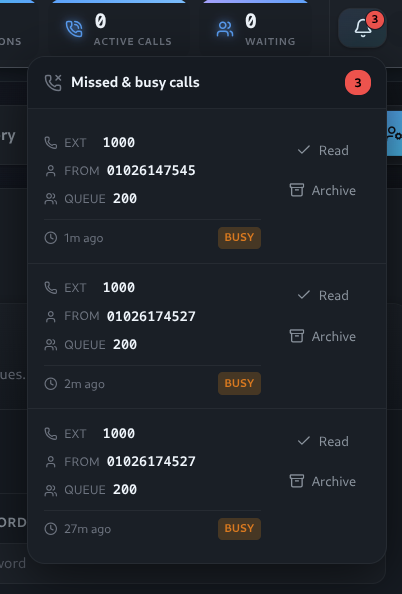
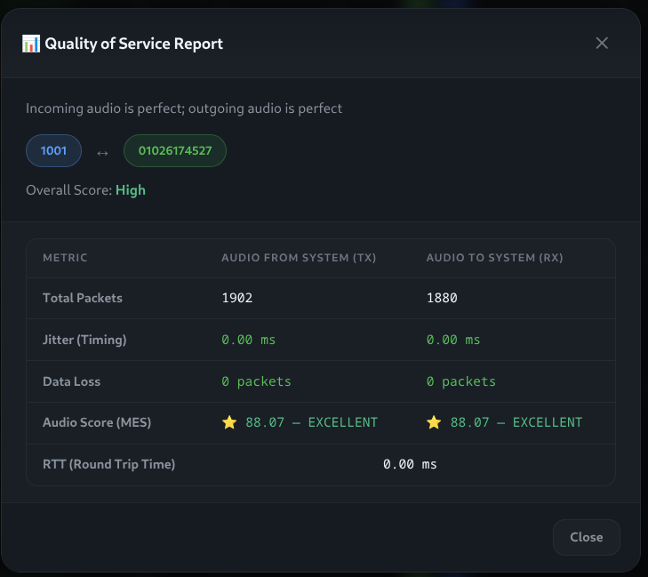
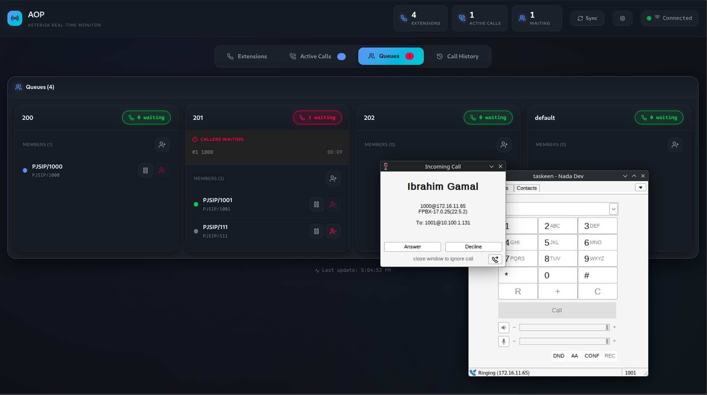
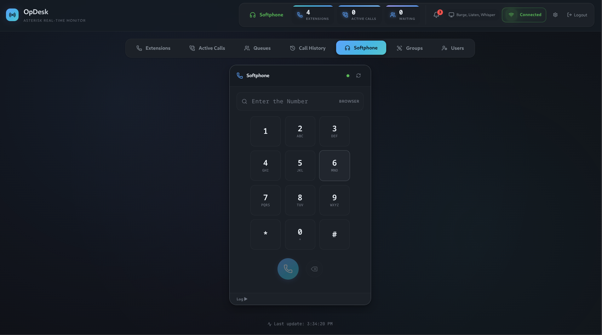
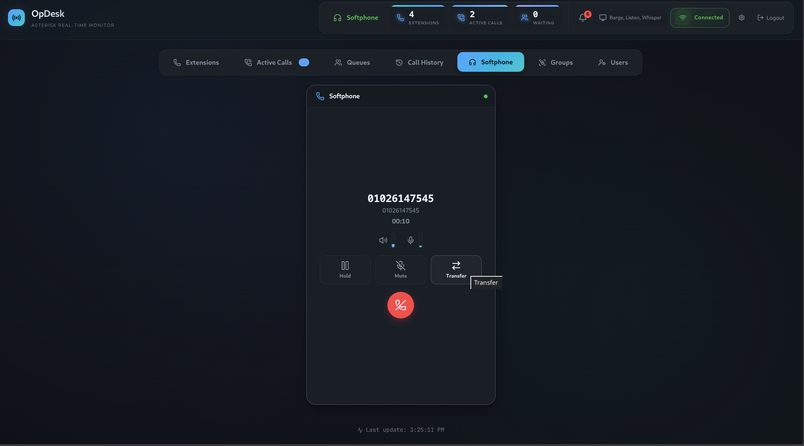
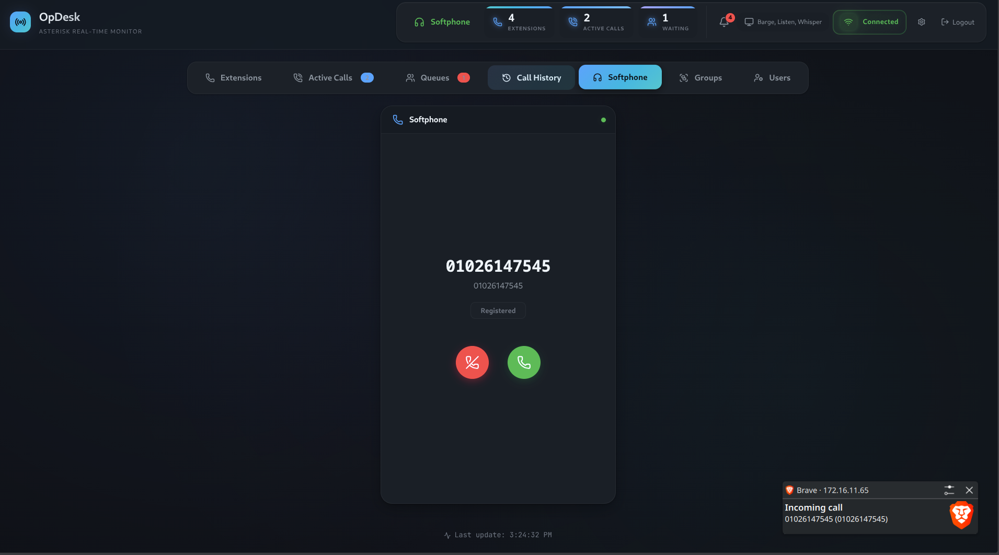

# OpDesk — Operator Panel for Asterisk

A real-time operator panel for **Asterisk PBX** (Issabel / FreePBX), similar to **FOP2** but built on a modern React + FastAPI stack. Monitor extensions and queues, manage active calls, browse CDR and recordings, use a built-in WebRTC softphone, and analyse call-center performance — all in one web app.

[](https://www.python.org/)
[](https://nodejs.org/)
[](https://reactjs.org/)
[](https://www.debian.org/)
[](LICENSE)

[Features](#features) • [Screenshots](#screenshots) • [Install](#install) • [Running](#running--updating) • [Configuration](#configuration) • [Documentation](#documentation) • [Architecture](#architecture) • [Community](#community--support)

Works with **Issabel** and **FreePBX** running Asterisk with AMI and WSS enabled.

---

## Features

- **Real-time panel** — extension status, active calls, queue state and call notifications over a WebSocket, with no polling. Live dashboard of active calls, waiting/ringing/longest-wait, workforce availability and today's KPIs.
- **Three roles** — **Admin** (everything, plus configuration and logs), **Supervisor** (scoped to their assigned agents and queues), **Agent** (their own calls and history).
- **Call management** — CDR browser with whole-history search, recording playback, QoS, and a **Call Journey** timeline for multi-leg calls.
- **Web softphone** — make and receive calls in the browser over WebRTC: hold, mute, transfer, queue login/logout, and Ready / Not-Ready with a reason code.
- **Supervision** — listen, whisper and barge, configurable per user.
- **Contacts** — a shared phonebook that puts names on numbers everywhere (dashboards, panels, softphone). Admins manage it from the UI; the CRM lookup fills it automatically, and manual entries always win. → [contract](docs/api/contact-lookup.md)
- **Analytics** — 12 KPI cards with period-over-period deltas, per-queue and per-agent breakdowns, a 7×24 heatmap and a call-level drilldown with CSV/XLSX export. → [guide](docs/guides/analytics.md)
- **CRM integration** — push call data to any CRM (API key, Basic, Bearer or OAuth2) with a selectable field set, configurable wire key names, outcome remapping and per-direction filtering. Every attempt is logged and can be replayed. → [contract](docs/api/webhooks.md)
- **Integration API** — scoped machine-to-machine API keys for reading live state, call history and analytics, plus click-to-call origination. → [reference](docs/api/endpoints.md)
- **Logs page** — a live Asterisk AMI event console and a searchable log of every CRM delivery, with request/response bodies and a manual resend.
- **Call recording + VAD** — full-call recording via MixMonitor plus separate per-leg WAVs, and automatic post-call talk/silence analysis (Silero VAD, with a WebRTC VAD fallback).
- **Mobile & browser push** — wake a Flutter/native softphone via APNs VoIP or high-priority FCM, and a closed browser tab via VAPID Web Push. → [guide](docs/guides/mobile-push.md)
- **Multi-language UI** — English, Arabic (RTL), Spanish and Portuguese, switchable without a restart.

---

## Screenshots

| Active calls | Call Journey | Call log | Dashboard | Notifications | QoS |
|--------------|--------------|----------|-----------|---------------|-----|
| [](screenshots/active_calls.png) | [](screenshots/call_journey.png) | [](screenshots/call_history.png) | [](screenshots/extensions_dashboard.png) | [](screenshots/notfication.png) | [](screenshots/qos.png) |

| Queue | Softphone | Softphone (in-call) | Softphone (ringing) |
|-------|-----------|---------------------|---------------------|
| [](screenshots/queue.png) | [](screenshots/softphone.png) | [](screenshots/softphone_incall.png) | [](screenshots/softphone_rining.png) |

*QoS verified on FreePBX.*

---

## Prerequisites

- Issabel or FreePBX with Asterisk and **AMI** enabled
- Asterisk plain WebSocket (port 8088) enabled — the installer checks this automatically
- MySQL/MariaDB (for the FreePBX extension list)
- `sudo` and `curl` (for the installer)

The installer can install Python 3.11+, Node.js (via nvm), git, lsof, curl and Nginx if they are missing. The Docker image builds the frontend on Node 22.

> ⚠️ **FreePBX and Issabel occupy ports 80 and 443.**
> Both run Apache there for their own admin UI. On a shared machine you must move Apache **before** installing, or Nginx will fail to start:
>
> ```bash
> sudo sed -i 's/\bListen 80\b/Listen 8080/' /etc/httpd/conf/httpd.conf
> sudo sed -i 's/:80>/:8080>/g' /etc/httpd/conf.d/*.conf
> sudo sed -i 's/:443>/:4443>/g; s/^Listen 443/Listen 4443/' /etc/httpd/conf.d/ssl.conf
> sudo systemctl restart httpd
> ```
>
> This is the single most common installation problem.

---

## Install

Both options end up in the same place: Nginx terminates TLS on **443** and proxies to uvicorn on loopback.

### Option A — Native (`install.sh`)

```bash
# LAN / self-signed certificate
curl -k -O https://raw.githubusercontent.com/Ibrahimgamal99/OpDesk/main/install.sh
chmod +x install.sh && sudo ./install.sh

# Public internet — DNS must already point here (Let's Encrypt)
sudo OPDESK_DOMAIN=opdesk.example.com OPDESK_LE_EMAIL=admin@example.com ./install.sh
```

The script clones to `/opt/OpDesk`, installs dependencies, detects Issabel/FreePBX, configures the database and an AMI user, installs Nginx as a TLS-terminating reverse proxy, obtains a certificate, writes `backend/.env`, and installs a systemd unit.

OpDesk is then at **`https://<server-ip>`** or **`https://<your-domain>`**.

**Default login:** username `admin`, password as printed by the installer. Change it immediately.

### Option B — Docker

```bash
git clone https://github.com/Ibrahimgamal99/OpDesk.git && cd OpDesk
cp .env.example .env && nano .env      # if the PBX is on this host, use host.docker.internal
mkdir -p cert && openssl req -x509 -newkey rsa:4096 \
  -keyout cert/opdesk_key.pem -out cert/opdesk_cert.pem -days 365 -nodes -subj "/CN=localhost"
docker compose up --build -d
```

The container runs with `network_mode: host`; uvicorn serves plain HTTP on `127.0.0.1:8765` and Nginx on the host terminates TLS. Two-stage build: `node:22-bookworm-slim` builds the frontend, `python:3.11-slim` runs it. Health check: `curl -fsS http://localhost:8765/` every 30 s.

### Topology

```
Browser ──HTTPS/WSS──► Nginx :443 ──► uvicorn 127.0.0.1:8765      (app + API + /ws)
                                  └─► Asterisk  127.0.0.1:8088    (SIP-over-WS at /sip-ws)
```

---

## Running & updating

```bash
./start.sh          # production
./start.sh -d       # dev mode with hot reload, no Nginx
```

The installer enables `opdesk.service`, so OpDesk starts on boot and restarts on failure.

| Action | Command |
|--------|---------|
| Start / stop / restart | `sudo systemctl {start,stop,restart} opdesk` |
| Status | `sudo systemctl status opdesk` |
| Live logs | `sudo journalctl -u opdesk -f` |
| Enable / disable on boot | `sudo systemctl {enable,disable} opdesk` |

**Updating:** re-run `install.sh`. It pulls the latest code, regenerates the Nginx config preserving LAN/public mode, and restarts the service. To switch to a public domain, add `OPDESK_DOMAIN=…` to that same command.

---

## Configuration

Runtime configuration lives in `backend/.env`; see [`.env.example`](.env.example) for the annotated list. Everything an operator changes day to day is in the web UI under **Settings**:

| Sub-tab | What it configures |
|---|---|
| **Integrations / CRM** | CRM URL and credentials, which call fields to push, wire key names, outcome remapping, duration format, direction filters, and a connection test. |
| **API Keys** | Machine-to-machine credentials and their scopes (admin only). |
| **QoS** | RTP quality reporting into the CDR `userfield`. |
| **Analytics** | SLA thresholds, FCR window, short-abandon threshold. |
| **SIP TLS** | TLS transport for SIP endpoints. |
| **Mobile Wake** | The predial hook that wakes a mobile softphone, and its wait time. |
| **Recording** | Enable recording and pick the format — `wav`, `wav49`, `gsm`, `g722`, `ulaw`, `alaw` or `sln`. |
| **Not-Ready Codes** | The pause-reason catalog agents choose from. |

CRM changes apply **live, with no restart**.

**Debugging.** Admins get a **Logs** page: a live AMI event console (off by default — turn on capture when you need it) and a searchable CRM delivery log. For browser-side issues, open the app once with `?debug=1`; the frontend then ships lifecycle and SIP events to the backend log as `CLIENT[session]` lines.

---

## Documentation

| Guide | What it covers |
|---|---|
| [docs/api/overview.md](docs/api/overview.md) | Base URL, JWT and API-key auth, scopes, roles, errors, status codes, WebSocket, pagination. |
| [docs/api/endpoints.md](docs/api/endpoints.md) | Endpoint-by-endpoint reference for the incoming API. |
| [docs/api/webhooks.md](docs/api/webhooks.md) | The **outgoing** CRM push: field catalog, key names, duration formats, outcome values, delivery log. |
| [docs/api/openapi.yaml](docs/api/openapi.yaml) | OpenAPI 3.0 spec. Served live at `GET /api/openapi.yaml`. |
| [docs/guides/analytics.md](docs/guides/analytics.md) | Every KPI, how it is computed, and how to tune it. |
| [docs/guides/mobile-push.md](docs/guides/mobile-push.md) | Firebase and APNs setup for mobile softphone wake-up. |

FastAPI also serves generated interactive docs at `/docs` and `/redoc`.

---

## Architecture

```
                        ┌──────────────────────────────────────────────────────────┐
         443/tcp        │   Nginx (TLS terminate)                                  │
  Browser ────────────► │  /        → 127.0.0.1:8765 uvicorn                       │
        (HTTPS/WSS)     │  /        (Sec-WebSocket-Protocol: sip) → 127.0.0.1:8088 │
                        │  /ws      → 127.0.0.1:8765 uvicorn                       │
                        │  /sip-ws  → 127.0.0.1:8088 Asterisk WS                   │
                        └──────────┬───────────────────────────────────────────────┘
                                   │ plain HTTP (loopback)
                    ┌──────────────▼───────────────┐      ┌─────────────────┐
                    │  FastAPI Server (uvicorn)     │◄───►│  Asterisk AMI   │
                    │  127.0.0.1:8765               │     │  localhost:5038 │
                    └──────────────┬────────────────┘     └─────────────────┘
                                   │ SQL (read/write)
                                   ▼
                        ┌────────────────────────┐
                        │   MySQL / MariaDB DB   │
                        └────────────────────────┘
```

| Component | Responsibility |
|---|---|
| **React frontend** (Vite + TS) | Renders the panel. Takes live state over the WebSocket; uses REST for history and configuration. |
| **FastAPI backend** | Holds a long-lived AMI connection, normalises Asterisk events into presence / queue / journey events, fans them out over the WebSocket with per-role scoping, and serves the REST API. |
| **AMI integration** | Signalling, monitoring and call control (originate, spy/whisper/barge, transfer). OpDesk does **not** replace the dialplan — FreePBX/Issabel still owns it. |
| **Nginx** | Terminates TLS (required for `getUserMedia`), proxies `/ws` to the backend and `/sip-ws` to Asterisk. Also auto-routes root-path connections advertising `Sec-WebSocket-Protocol: sip` straight to Asterisk. |
| **Databases** | Three: `asterisk` (FreePBX config, read), `asteriskcdrdb` (CDR, read), and OpDesk's own (see below). |

OpDesk's own database holds users, roles and group assignments; cached extension/queue metadata; the contacts phonebook (`contacts`, manual + CRM-resolved); notifications (`call_notifications`, auto-cleaned after 7 days); VAD results; agent presence segments; supervision events; API keys; the CRM delivery log; and the analytics rollup tables (`analytics_hourly`, `analytics_daily`, `analytics_agent_daily`), refreshed every 15 minutes by a background task.

Call Journey timelines and the call log are **derived on demand** from the Asterisk CDR — OpDesk does not duplicate CDR storage.

---

## Tech stack

- **Backend** — Python 3.11+, FastAPI, WebSockets, asyncio, MySQL/MariaDB, `openpyxl` (optional, for XLSX export), `onnxruntime` (optional, for Silero VAD)
- **Frontend** — React 18, TypeScript, Vite, Recharts, Framer Motion, Lucide React, react-i18next

---

## Community & support

- **Mailing list**: [opdesk-dev@googlegroups.com](mailto:opdesk-dev@googlegroups.com)
- **Telegram**: [t.me/+i1OVDDPgGLo0MGZh](https://t.me/+i1OVDDPgGLo0MGZh)
- **Issues & contributions**: [GitHub Issues](https://github.com/Ibrahimgamal99/OpDesk/issues)
- **Author**: [Ibrahim Gamal](https://github.com/Ibrahimgamal99) — [LinkedIn](https://www.linkedin.com/in/ibrahim-gamal99) · ib.gamal.a@gmail.com

If OpDesk is useful to you: star the repo, report bugs, or contribute. The project is **MIT** licensed; developed by Ibrahim Gamal with AI-assisted tooling for boilerplate and acceleration.
